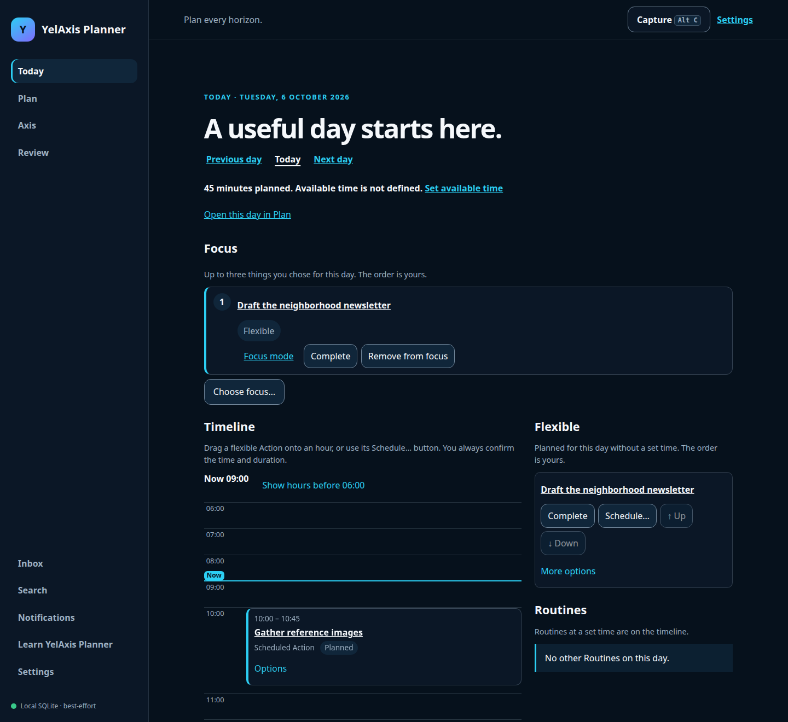
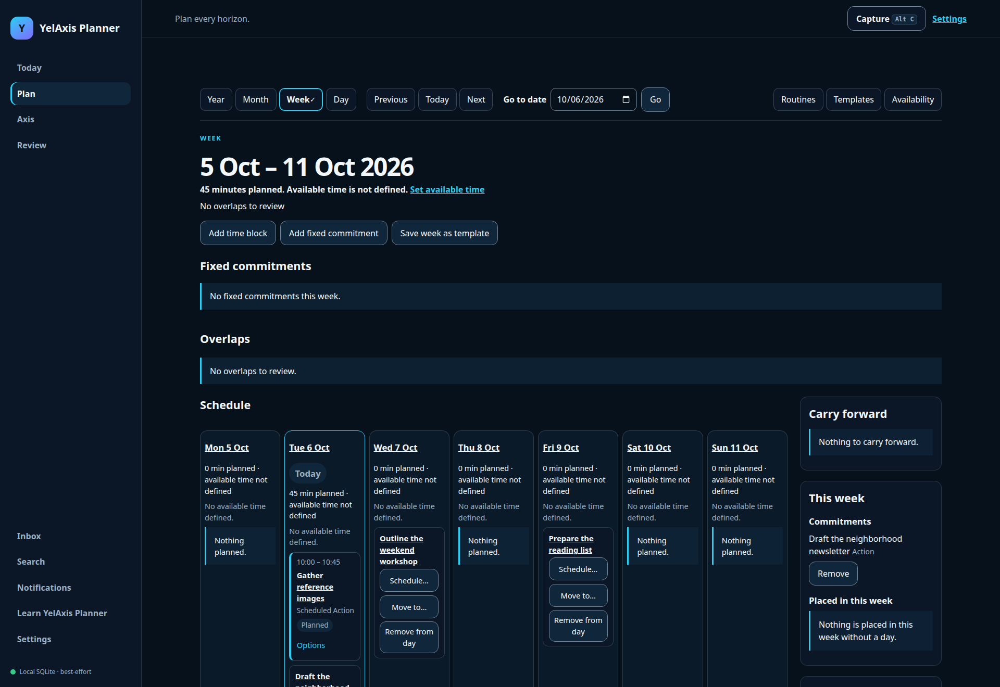

# YelAxis Planner

A desktop planner for connecting long-term direction with the work of an ordinary day. Capture
Actions, plan across Year, Month, Week and Day, choose up to three focus items, and reflect through
daily, weekly, monthly and yearly reviews. Planning works locally without an account or network.
Optional accounts add synchronization between devices.

This is a beta source release. See [verification and known limits](docs/verification.md) for the
scope of testing and observations still needed.



## What you can do

- **Capture and decide:** quick capture, Inbox triage, Action details, ordering, bulk changes and
  Undo.
- **Plan every horizon:** flexible placements, fixed Time Blocks, Commitments, availability,
  capacity, explicit overlap choices, Routines and reusable Templates.
- **Connect work to direction:** Axes, Outcomes, Projects, Milestones and an optional Alignment Map.
- **Act and reflect:** Today, a three-item focus plan, a presentation-only Focus timer and saved
  reviews.
- **Find and protect your plan:** offline Search, readable JSON backups, previewed imports, CSV,
  Review Markdown and recovery tools.
- **Sync by choice:** email/password accounts, local-first edits, visible queued work and explicit
  conflicts when account support is configured.



## Run locally

Use Node **24.18 or newer in the 24 series** and pnpm **11.9 or newer in the 11 series**, as
declared in [package.json](package.json).

```sh
git clone https://github.com/abdumajitovelbek/YelAxis-Planner.git
cd YelAxis-Planner
pnpm install --frozen-lockfile
pnpm run dev
```

Open the URL printed by Vite and choose local planning. No environment file or backend is needed.
For a production build served locally:

```sh
pnpm run build
pnpm run preview
```

See [getting started](docs/getting-started.md) for the first planning loop and PWA installation,
[accounts and sync](docs/accounts-and-sync.md) for optional accounts, and
[self-hosting](docs/self-hosting.md) for local Supabase and operator setup.

## Keep a separate backup

Your plan is a SQLite database saved in this site's browser storage. Browser storage is best effort:
clearing site data, deleting a browser profile or eviction can remove it. The database and exports
are not encrypted. One active tab owns a plan at a time. Export a JSON backup through **Settings →
Data** and confirm the downloaded file exists before changing browsers or clearing storage.
[Data, privacy and recovery](docs/data-and-privacy.md) explains the separate local, cloud and file
boundaries.

Chromium desktop supports the website and browser-native PWA installation. Firefox desktop supports
the website. Safari and native mobile clients are outside the current verified target. Reminders are
delivered while the app is open; missed reminders appear after reopening.

## Explore and contribute

Start with the [user guide](docs/user-guide.md) or the [documentation index](docs/README.md).
Developers can read the [architecture](docs/architecture.md),
[development guide](docs/development.md) and [contribution guide](CONTRIBUTING.md). Report sensitive
issues using [SECURITY.md](SECURITY.md).

YelAxis Planner is licensed under [Apache-2.0](LICENSE). See [NOTICE](NOTICE) for project notices.
[Third-party notices](apps/web/public/third-party-notices.txt) and the
[dependency inventory](docs/release/dependencies.md) preserve dependencies' own terms.
