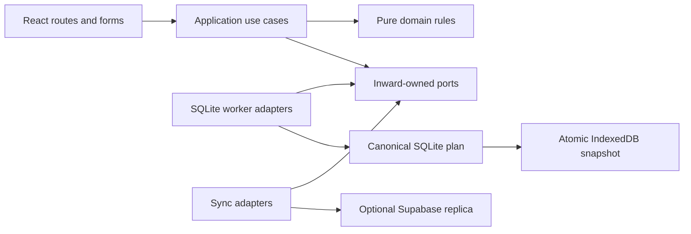

# Architecture

YelAxis Planner uses clean/hexagonal boundaries around one local SQLite plan. The website and
installed PWA are the same application; installation changes presentation, not data ownership.

`apps/web` is the production composition root. It wires use cases and concrete adapters. UI renders
query results and invokes commands; it never issues SQL or direct cloud planning writes. React state
holds temporary forms, selections, dialogs and navigation state.

## Repository map

| Path                   | Owns                                                                            |
| ---------------------- | ------------------------------------------------------------------------------- |
| `apps/web`             | Routes, shell, forms, PWA/build policy, composition and browser journeys        |
| `packages/domain`      | Pure entities, state transitions, relationships, time and recurrence rules      |
| `packages/application` | Use cases, validation, command plans, transactions and inner ports              |
| `packages/data`        | Ordered migrations, record codecs, repositories, projections and browser worker |
| `packages/sync`        | Durable outbox coordination, transport, push/pull and conflict handling         |
| `packages/ui`          | Tokens, theme, motion, contrast and accessibility helpers                       |
| `packages/i18n`        | Message catalogs, locale formatting, direction and pseudo-locales               |
| `packages/config`      | Shared tooling configuration                                                    |
| `supabase`             | Local stack configuration, remote migrations, schemas, RPC and RLS              |
| `scripts`              | Repository, source, dependency, secret and backend preflight checks             |
| `docs`                 | User guides, engineering contracts, decisions and public verification           |

Ports belong to the inner layer that needs them. Adapters implement those ports and depend inward.
Domain imports no React, SQL, Supabase or notification runtime. Do not create a parallel package
when an owner exists, or introduce a global client store without an explicit architectural decision.

## A write from button to durable plan

1. A form collects temporary input and calls an application use case.
2. Runtime validation and pure domain rules validate owner, references, lifecycle, input limits and
   expected revisions.
3. The application assembles canonical changes, minimized events, Undo where supported, a command
   receipt and any required outbox group.
4. The Unit of Work commits the group through the shared serialized SQLite driver in the worker.
5. The worker atomically saves the complete versioned compressed image to IndexedDB before
   acknowledging success. Failure restores the prior image.
6. UI queries reload from canonical rows. Optional synchronization later replicates the committed
   group; network availability does not decide whether the local edit succeeds.

Stable command IDs make retries idempotent. Injected clocks and IDs keep domain/application tests
deterministic. Reads are owner-scoped, prepared and bounded, with stable tie-breaks and indexes.
Pagination bounds visible rows while preserving complete totals and history; it does not silently
truncate relevant canonical data.

## Startup, import and ownership

The worker loads the persisted image, verifies the immutable migration ledger and validates health
before exposing it. A previously completed full health result can be reused only for the exact same
bytes, image length, engine and build policy. Changed or unrecognized images receive full integrity
and foreign-key checks. This metadata is a validation optimization, not authentication, encryption
or a backup.

An exclusive Web Lock allows one active tab per database. Requests share a serial queue around the
worker's single connection. Startup waits briefly for a closing owner; retained ownership fails
closed instead of overwriting it.

Imports decode and preview before application. Journals and verified pre-import backups support
resume and atomic replacement. Import uses ordinary application rules and outbox semantics, never
raw UI writes. Forward migrations preserve data and applied checksums; no reset-based repair exists.

## Replication and static caching

Each local/account identity has an isolated database. Sync uses base snapshots, server revisions,
idempotent groups, tombstones, explicit conflicts and an atomic pull cursor. Server RPCs validate
schemas, authenticated owners and relationship endpoints behind RLS.

The service worker caches revisioned static assets and navigation shell only. Account sessions,
planning records, API responses and portable files stay outside it. Updates ask for explicit
activation. [Storage](contracts/storage-and-migrations.md), [sync](contracts/sync-protocol.md) and
[identity](contracts/identity-and-ownership.md) contracts give more detail.
[Common changes](development.md#common-changes) shows where to start implementation.
